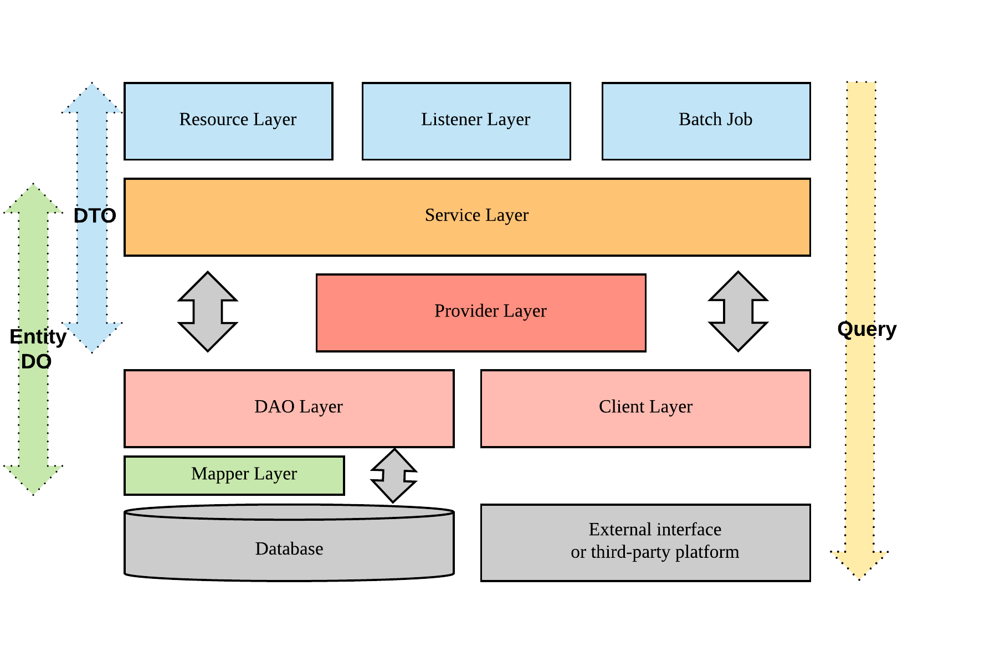

# 六、工程结构
## (一) 应用分层 

1. 【强制】图中默认上层依赖于下层，箭头关系表示可直接依赖，如：Service层可以依赖于Provider层，也可以直接依赖于DAO层，依此类推：
 
 - Resource Layer: 可直接封装 Service 方法暴露成 RPC 接口 或者 http 接口;该层实现参数验证, 安全控制、流量控制等
 - Listener Layer: 监听从MQ里的消息，该层可以实现UserContext初始化等 
 - Batch Job： 负责管理所有batch job，包括job的触发规则，异常处理机制 
 - Service Layer：相对具体的业务逻辑服务层, 该层可以实现Audit Log。 
 - Provider Layer：通用业务处理层，它有如下特征：
  1） 对第三方平台封装的层，预处理返回结果及转化异常信息；
  2） 对Service层通用能力的下沉，如缓存方案、中间件通用处理；
  3） 与DAO层交互，对多个DAO的组合复用。
 - DAO层：数据访问层，与底层MySQL、Oracle、Hbase等进行数据交互。 
 - Client Layer: 包装其他微服务或者第三方服务的包装类
 - Mapper Layer:  Mybatis 自动生成的接口，与SQL statement来一一对应的
 - 外部接口或第三方平台：包括其它微服务RPC开放接口，基础平台，其它公司的HTTP接口。

2. 【强制】分层领域模型规约：
  - Entity：类名和表名一致，字段与数据库表字段一一对应，通过DAO层向上传输数据源对象。现在TSCN的Entity不用**Entity**作为后缀，而是放在entity的Package下 **Entity只能存在于Service Layer及以下**
  - DO (Data Object)： 可以继承Entity或组合Entity，添加聚合属性或关联表属性，用以封装多表查询对象，通过DAO层向上传输数据源对象。Client Layer中从外部接受的对象用Data Object来封装,
 **DO只能存在于Service Layer及以下**
  - DTO（Data Transfer Object）：数据传输对象，Service或Provider向外传输的对象。**DTO只能存在于Provider Layer及以上**
  - Query：数据查询对象，各层接收上层的查询请求。注意超过2个参数的查询封装，禁止使用Map类来传输。**Query对象可以贯穿所有分层**